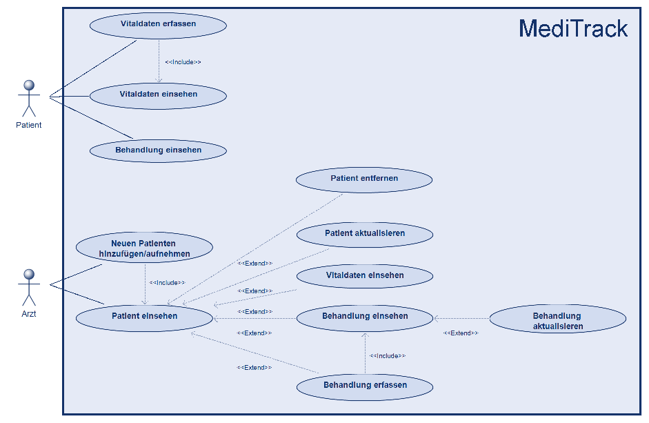
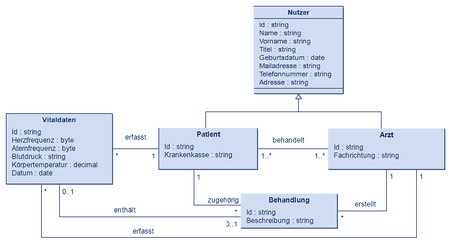
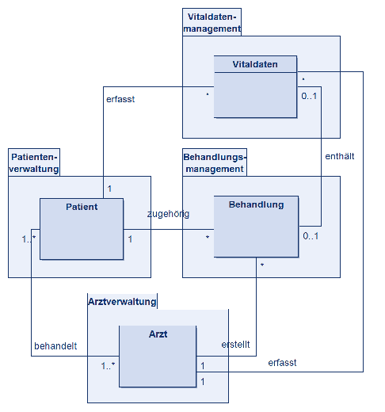
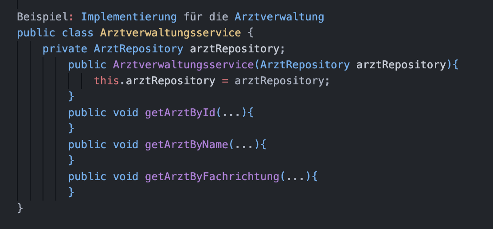

# Übung 3: Systemarchitektur des Projekts "MediTrack: Patientendatenverwaltung und –überwachung"

## 1. Event Storming durchführen

- Vitaldaten erfassen
  - Ärzte können neue Vitaldaten für ihre Patienten erfassen und korrigieren.
  - Ein Patient kann die eigenen Vitaldaten erfassen und korrigieren.
- Vitaldaten einsehen
  - Ärzte können die Vitaldaten ihrer Patienten einsehen.
  - Patienten können ihre eigenen Vitaldaten einsehen.
- Vitaldaten abfragen
  - Ärzte können die Vitaldaten bei ihren Patienten abfragen.
- Vitaldaten an Arzt übermitteln
  - Patienten können ihre eigenen, erfassten Vitaldaten an Ärzte übermitteln.
- Patient hinzufügen
  - Ärzte können neue Patienten aufnehmen/registrieren.
- Patient einsehen
  - Ärzte können ihre Patienten im System einsehen.
- Patientendaten aktualisieren
  - Ärzte können die Daten ihrer Patienten aktualisieren.
- Patient entfernen
  - Ärzte können ihre Patienten aus dem System entfernen.
- Behandlung erfassen
  - Ärzte können Behandlungen zu Patienten erfassen.
- Behandlung einsehen
  - Ärzte können die Behandlungen ihrer Patienten einsehen.
  - Patienten können die eigenen Behandlungen einsehen.
- Behandlung aktualisieren
  - Ärzte können die Behandlungen ihrer Patienten aktualisieren.

## 2. Domänenmodell erstellen

## 3. Bounded Context identifizieren

- Patientenverwaltung
  - Zuständig für die Verwaltung von Patientendaten und umfasst das Hinzufügen, Einsehen, Aktualisieren und Entfernen von Patientendaten.
- Arztverwaltung
  - Zuständig für das Einsehen von Arztdaten.
- Behandlungsmanagement
  - Zuständig für das Management von Behandlungen und umfasst das Erfassen, Einsehen und Aktualisieren von Behandlungen.
- Vitaldatenmanagement
  - Zuständig für die Verwaltung von Vitaldaten und umfasst das Erfassen, Einsehen, Abfragen und Übermitteln von Vitaldaten.

## 4. Entitäten und Aggregates definieren

- Patientenverwaltung
  - Entität: Patient
  - Aggregate: Enthält alle Daten zum Patienten (siehe Klassen Nutzer und Patient)
- Arztverwaltung
  - Entität: Arzt
  - Aggregate: Enthält alle Daten zum Arzt (siehe Klassen Nutzer und Arzt)
- Behandlungsmanagement
  - Entität: Behandlung
  - Aggregate: Enthält alle Daten zur Behandlung (siehe Klasse Behandlung)
- Vitaldatenmanagement
  - Entität: Vitaldaten
  - Aggregate: Enthält alle Informationen zu den Vitaldaten (siehe Klasse Vitaldaten)

## 5. Domain Services und Repositories

### Domainservices:

- Patientenverwaltungsservice
  - Verantwortlich für die Verwaltung der Patientendaten (Patient anlagen, Patient löschen, Pflege der Grunddaten usw.)
- Arztverwaltungsservice
  - Verantwortlich für die Verwaltung der Arztdaten (Arztauswahl usw.)
- Behandlungsmanagementservice
  - Verantwortlich für die Verwaltung von Behandlungen
- Vitaldatenmanagementservice
  - Verantwortlich für die Verwaltung der Vitaldaten (Vitaldatenerfassung, Vitaldatenauswertung usw.)

### Repositories:

- Patientenverwaltung PatientRepository: Verwaltet die Persistenz der Patientendaten
- Arztverwaltung ArztRepository: Verwaltet die Persistenz der Ärzte
- Behandlungsmanagement BehandlungRepository: Verwaltet die Persistenz der Behandlungen
- Vitaldatenmanagement VitaldatenRepository: Verwaltet die Persistenz der Vitaldaten

### Übersicht der Repositories und Methoden:

#### PatientRepository

- getPatientById(String Id)
- getPatientByName(String name)
- getPatientBy(Date geburtsdatum)
- cratePatient(Patient patient)
- deletePatient(String Id)
- updatePatient(Patient patient)

#### ArztRepository

- getArztById(String Id)
- getArztByName(String name)
- getArztByFachrichtung(String fachrichtung)

#### BehandlungRepository

- getBehandlungByPatientenId(String Id)
- createBehandlung(Behandlung behandlung)
- updateBehandlung(Behandlung behandlung)

#### VitaldatenRepository

- getVitaldatenByPatientenId(String Id)
- getVitaldatenByID(String Id)
- updateVitaldaten(Vitaldaten vitaldaten)
- createVitaldaten(Vitaldaten vitaldaten)

## 6. Implementierungsstrategie

Die Implementierungsstrategie umfasst die folgenden Schritte:

- Festlegung zur Benutzung eines Frameworks -> Spring Boot
- Festlegen der SQL-Datenbank -> PostgreSQL
  - Erstellung von Schemata und mit Daten anreichern
- Festlegung Frontend Framework -> React
- Entitäten in Java-Klassen umsetzen
  - Attribute und Methoden vom Klassendiagramm ableiten und umsetzen
  - Aufteilen der einzelnen Gruppenmitglieder
- Für jeden Domain Service wird eine Service-Klasse erstellt, die die Geschäftslogik implementiert. Diese Services arbeiten eng mit den Repositories zusammen, um die Persistenz der Entitäten zu gewährleisten.
- Repositories umsetzen
  - Jedes Repository wird als Interface definiert
  - Erstellen von Methoden zum Speichern, Ändern und Löschen der Entitäten

#### Beispiel: Implementierung für die Arztverwaltung

