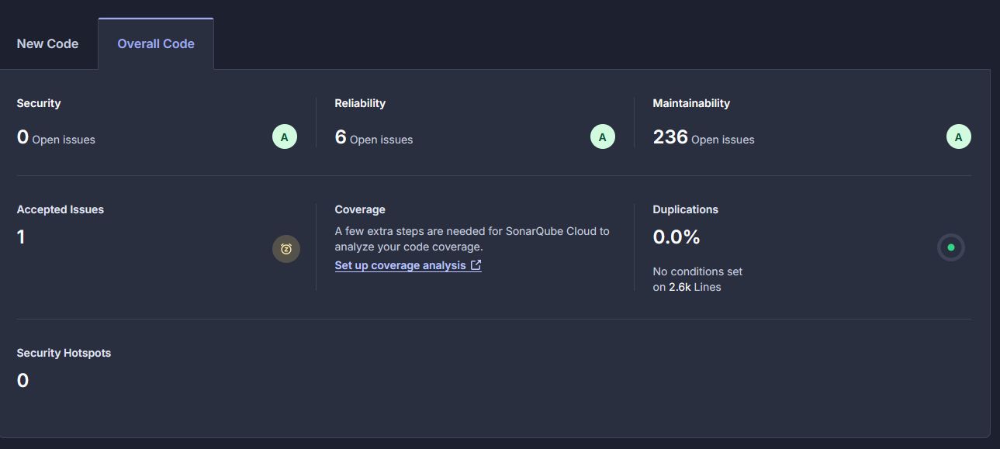
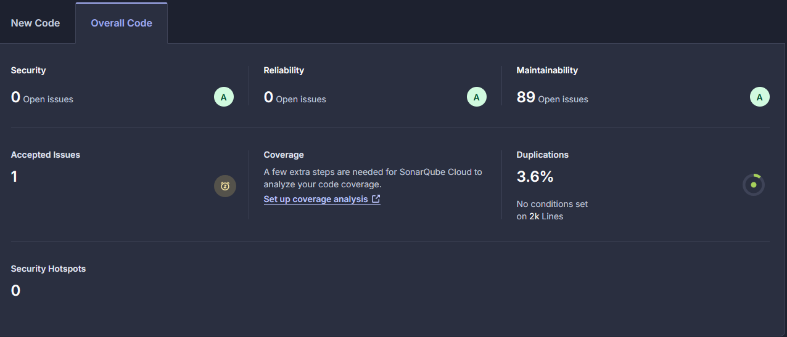

Blatt 5 Aufgabe
================
Einfluss von Metriken
---------------------------
Der kombinierte Einsatz von Code-Metriken (via SonarQube) und LLM-Unterstützung hat sich als äußerst wertvoll für die Verbesserung der Codequalität erwiesen. Die Metriken liefern objektive, quantifizierbare Einblicke in Problembereiche des Codes, während das LLM diese Erkenntnisse mit kontextbezogenen Verbesserungsvorschlägen ergänzt.
Besonders effektiv war die Kombination bei:
1. Code-Struktur Optimierung:
- Metriken identifizierten komplexe Methoden und Klassen
- LLM schlug konkrete Refactoring-Strategien vor, die auf Best Practices basieren
- Die Vorschläge waren direkt implementierbar und führten zu messbaren Verbesserungen
2. Technische Schulden:
- SonarQube zeigte technische Schulden in verschiedenen Bereichen
- LLM half bei der Priorisierung und lieferte pragmatische Lösungsansätze
- Dadurch wurde ein strukturierter Abbau technischer Schulden möglich
3. Konsistenz im Code:
- Metriken deckten Inkonsistenzen in der Codebase auf
- LLM generierte Templates für einheitliche Implementierungen
- Dies führte zu besser wartbarem und verständlicherem Code

Allerdings gab es auch Herausforderungen:
- Nicht alle LLM-Vorschläge waren im Projektkontext sinnvoll
- Die Balance zwischen theoretisch optimalen und praktisch umsetzbaren Lösungen musste gefunden werden
- Manchmal waren die Metrik-Schwellenwerte zu strikt für die Projektanforderungen

Fazit: Die Kombination von Metriken und LLM hat sich als wertvolles Werkzeug für die kontinuierliche Verbesserung der Codequalität erwiesen. Sie ermöglicht einen datengetriebenen, aber dennoch pragmatischen Ansatz zur Codeoptimierung. Besonders wertvoll war die Fähigkeit des LLMs, Metrik-basierte Erkenntnisse in konkrete, umsetzbare Verbesserungsvorschläge zu übersetzen. Für zukünftige Projekte würde ich diesen kombinierten Ansatz von Beginn an einsetzen, um technische Schulden früh zu erkennen und zu adressieren.

Projekt in SonarQube bevor das Refactoring durchgeführt wurde:

Projekt in SonarQube nach dem Refactoring:
