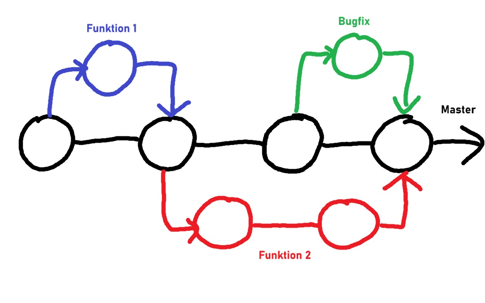

# Moderne Softwareentwicklung

## Was ist Git und warum sollte es verwendet werden?

Softwareprojekte unterliegen ständigen Änderungen durch das Beheben von Fehlern, die Weiterentwicklung und das Hinzufügen von Funktionen sowie durch struktuelle Veränderungen der Software. Um alle Änderungen zu protokollieren und nachvollziehen zu können, ist die Nutzung eines Versionskontrollprograms erforderlich. Zusätzlich ist es wichtig, dass Teams gemeinsam an einem Projekt arbeiten können, ohne dass es zu Konflikten kommt oder Änderungen verloren gehen.

Git ist ein Open-Source-Revisionskontrollsystem und das bisher am weitesten verbreitete Tool für die Versionskontrolle von Softwareprojekten. In Git werden nicht nur die Änderungen eines Projekts gespeichert, sondern Snapshots der Dateien erstellt, wodurch Dateiänderungen besser nachvollzogen und ggf. wieder rückgängig gemacht werden können. Zusätzlich sind in Git viele Softwaretools von Drittanbietern integriert und die Funktionalitäten sind auf Performance, Sicherheit und Flexibilität ausgerichtet.

Aus diesen Gründen ist Git zu einem unverzichtbaren Tool für Entwickler geworden und wird in vielen Unternehmen als Standard eingesetzt.

## Grundlegende Git-Befehle

### Repositories anlegen

-   git init [project-name]: Legt ein neues lokales Repository mit dem angegebenen Namen an
-   git clone [url]: Klont ein Projekt und lädt seine gesamte Versionshistorie herunter

### Änderungen vornehmen

-   git status: Listet alle zum Commit bereiten neuen oder geänderten Dateien auf
-   git diff: Zeigt noch nicht indizierte Dateiänderungen an
-   git add [file]: Indiziert den derzeitigen Stand der Datei für die Versionierung
-   git commit -m"[descriptive message]": Nimmt alle derzeit indizierten Dateien permanent in die Versionshistorie auf

### Änderungen gruppieren

-   git branch: Listet alle lokalen Branches im aktuellen Repository auf
-   git branch [branch-name]: Erzeugt einen neuen Branch
-   git merge [branch-name]: Fasst die Historie des angegeben Branches mit der des aktuell ausgecheckten Branches zusammen

### Dateinamen refaktorisieren

-   git rm [file]: Löscht die Datei aus dem Arbeitsverzeichnis und wird im Index zur Löschung markiert, dadurch wird die Datei beim nächsten commit aus der Versionskontrolle gelöscht
-   git mv [file-original] [file-renamed]: Ändert den Namen der Datei und bereitet diese für den Commit vor

### Historie überprüfen

-   git log: Listet die Versionshistorie für den aktuellen Branch auf

### Änderungen synchronisieren

-   git push [remote] [branch]: Pusht alle Commits auf dem lokalen Branch zu GitHub
-   git pull: Pullt die Historie vom externen Repository und integriert die Änderungen

## Quellen

-   Studienmodul MS: https://moodle.oncampus.de/mod/loop/view.php?id=1303451
-   Git Dokumentation: https://git-scm.com/doc
-   Git Sheet: https://training.github.com/downloads/de/github-git-cheat-sheet/

## Branches und ihre Nutzung, Umgang mit Merge-Konflikten

### Branches

### Nutzen

-   isolierte Entwicklungsstränge -> Änderungen am Code ohne den Hauptcode zu beeinträchtigen,

-   paralleles Arbeiten möglich und

-   testen von neuen Code und Bugfixbereinigung ohne den Hauptcode zu verändern -> Integration in den Hauptcode nach erfolgreichem Test

### Branch erstellen

Der Branch wird inhaltlich aus dem Branch erstellt, von dem er erzeugt wird. Nach der Erstellung wechselt man direkt hinein.

Mit

> git checkout -b [neuer-branch-name]

wird ein neuer Branch erstellt. Dieser ist vorerst nur lokal gesichert. Danach muss der Branch in git hochgeladen werden:

> git push -u origin [neuer-branch-name]

Mit

> git checkout [branch-name]

wird in den angegebenen branch gewechselt.
Mit

> git fetch --all

werden alle Branches aus GitHub geholt.

### Merge

Nach der Funktionserweiterung oder Bugbehebung wird der Branch wieder in den Hauptstrang gemerged.
Hierfür muss man sich in dem Ziel-Branch befinden in dem die Änderungen gemerged werden sollen.
Bevor ein Merge stattfindet sollte mit einem

> git pull origin main

die neusten Änderungen gezogen werden, um sicher zu gehen, dass der lokale Branch auf dem neusten Stand ist.
Danach wir mit einem

> git merge [branch-name]

der Quell-Branch in den Ziel-Branch germerged.

### Merge-Konflikte

Es kann durchaus vorkommen, dass Merge-Konflikte entstehen. Meistens dann, wenn zwei Branches gleichzeitig Änderungen an der selben Datei vornehmen und Git diese nicht automatisch zusammen führen kann.
Passiert dies, erkennt Git Konflikte und zeigt die betroffenen Dateien.
In den betroffenen Dateien sind die folgenden Zeichen zu sehen

> "<<<<<<<", "======="

und

> ">>>>>>>"

Alles zwischen

> "<<<<<<"

und

> "======"

stammt von dem aktuellen Ziel-Branch und alles zwischen

> "========"
>
> und
> ">>>>>>>"

stammt vom Quell-Branch.

Die Konflikte müssen manuell gelöst werden. Die Änderungen müssen händisch zusammen gefügt werden oder einer der Blöke muss entfernt werden.
Danach muss die Datei mit einem

> git add [dateiname]

dem Ziel-Branch hinzugefügt werden.
Der Merge wird danach per

> git commit

und bei einem Remote-Repository mit

> git push origin [ziel-branch ]

abgeschlossen.

### Weitere Tipps zum Umgang mit Merge-Konflikten:

-   Verwendung von Diff-Tools um Unterschiede und Konflikte übersichtlich darzustellen

-   Konflikte früh erkennen und häufig pullen um sie direkt zu lösen bevor es große Konflikte werden

-   kleinteilige Commits um den neu erstellten Codekontext zu verstehen

## Git mit IntelliJ

## Nützliche Git-Tools und Plattformen

Git hat sich als eines der wichtigsten Versionskontrollsysteme etabliert und ist ein unverzichtbares Werkzeug für Entwickler und Teams, die an Softwareprojekten arbeiten. Die Wahl der richtigen Tools und Plattformen kann den Entwicklungsprozess erheblich erleichtern und die Zusammenarbeit verbessern. In diesem Text werden nützliche Git-Tools und Plattformen vorgestellt, die dir helfen können, deine Projekte effizient zu verwalten und den Überblick über Änderungen und Versionen zu behalten.

### Git-Plattformen

Git-Plattformen bieten Hosting-Dienste für Git-Repositories und ermöglichen die Zusammenarbeit zwischen Entwicklern durch Funktionen wie Pull Requests, Issues und Integrationen mit anderen Tools. Hier sind einige der bekanntesten und nützlichsten Git-Plattformen:

1. **GitHub**
   GitHub ist die bekannteste Plattform für die Verwaltung von Git-Repositories. Sie bietet Funktionen wie Pull Requests, Issues und Code Reviews, die die Zusammenarbeit in Teams erleichtern. Mit GitHub Actions können CI/CD-Workflows automatisiert werden.

2. **GitLab**
   GitLab ist eine umfassende DevOps-Plattform, die Git-Hosting sowie CI/CD-Funktionen integriert. Mit Merge Requests und einem eingebauten Issue-Tracker ist GitLab besonders für Teams geeignet, die eine All-in-One-Lösung suchen.

3. **Bitbucket**
   Bitbucket bietet Git-Hosting und ist besonders gut mit Atlassian-Tools wie Jira integriert. Es enthält auch Pipelines für CI/CD und unterstützt die Zusammenarbeit an Codeprojekten in einer benutzerfreundlichen Umgebung.

### Git-Tools

Git-Tools sind Softwareanwendungen, die die Nutzung von Git erleichtern, sei es durch grafische Benutzeroberflächen oder zusätzliche Funktionen. Hier sind einige nützliche Git-Tools, die dir helfen können, deine Repositories effektiv zu verwalten:

1. **SourceTree**
   SourceTree ist ein kostenloser Git-Client für Windows und macOS, der eine grafische Oberfläche für Git bietet. Es erleichtert das Management von Repositories, Branches und Commits, ohne dass die Kommandozeile benötigt wird.

2. **GitKraken**
   GitKraken ist ein leistungsstarker Git-Client mit einer modernen Benutzeroberfläche. Er bietet eine visuelle Darstellung von Branches und Commits und integriert Tools für Code Reviews und Teamkommunikation.

3. **Git Extensions**
   Git Extensions ist ein Open-Source-Git-Client für Windows, der eine umfangreiche Benutzeroberfläche und zusätzliche Funktionen bietet, um die Arbeit mit Git zu erleichtern. Es unterstützt auch die Integration mit Visual Studio.

4. **Git LFS (Large File Storage)**
   Git LFS ist eine Erweiterung für Git, die es ermöglicht, große Dateien effizienter zu verwalten. Anstatt große Dateien direkt im Repository zu speichern, werden sie in einem separaten Speicher abgelegt, was die Performance verbessert.

5. **Tower**
   Tower ist ein kostenpflichtiger Git-Client für macOS und Windows, der sich durch eine intuitive Benutzeroberfläche und umfassende Features auszeichnet. Er bietet Funktionen wie Undo-Commits und Stash-Management.

6. **Git Command Line**
   Die Git-Befehlszeile ist ein unverzichtbares Tool für Entwickler, die tiefere Kontrolle über ihre Repositories benötigen. Sie bietet die größte Flexibilität und ist für viele fortgeschrittene Operationen notwendig.
